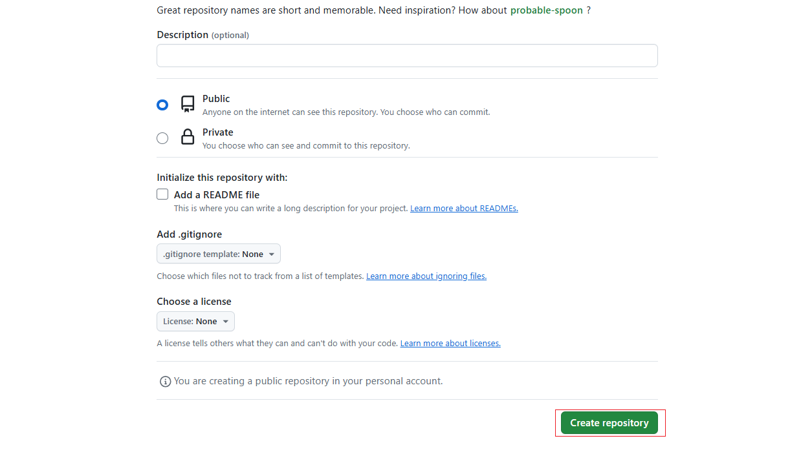
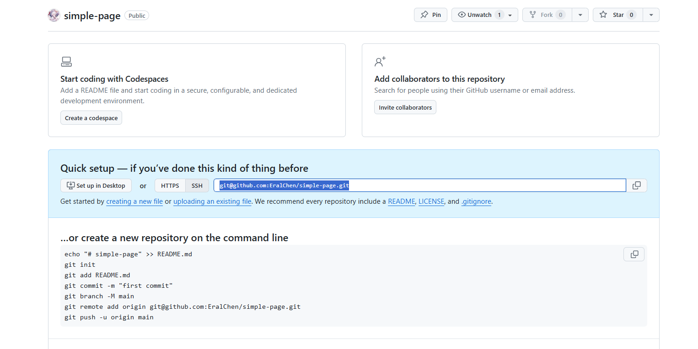

# 【CI/CD】学会使用 Github Action 自动化部署前端页面


## 序

你可能见过类似于这样的网站，

https://zhgcao.github.io

https://eralchen.github.io/vuesri

它可能是某人的博客、某个共享库的文档，

他们被叫做 `Github Pages`，是 Github 提供的一个静态页面托管服务。

如果你也想将自己的页面展示在互联网上，那么 `Github Pages` 是一个不错的选择。

配合 `Github Action`，只需要将代码推送到 `Github` 仓库，就可以自动部署 `Github Pages` .

## Github Pages 部署页面

这里从一个新的仓库开始，介绍如何使用 `Github Pages` 部署页面。

### 新建仓库

[Create a new repository](https://github.com/new), 填写仓库名称，点击 `Create repository`



> GitHub Pages 主要设计用于托管公开仓库的静态网站和文档。
>
> public 仓库免费使用，private 仓库需要付费升级 GitHub 账号。


### 初始化仓库




你可以根据提示来初始化仓库，

可以初始化一个新的仓库，

也可以 `push` 已存在的仓库到远程仓库。


这里已初始化一个新的仓库，为例:

```bash
# git clone [仓库地址] 
git clone git@github.com:EralChen/simple-page.git

```

如果从新建仓库开始，拉取到的将是一个空仓库。


我们拉取到的仓库默认在 `main` 分支下，通常 `main` 分支是用来存放项目的源代码。

这里我们先简单放上一个 `README.md` 文件，然后提交到远程仓库。


