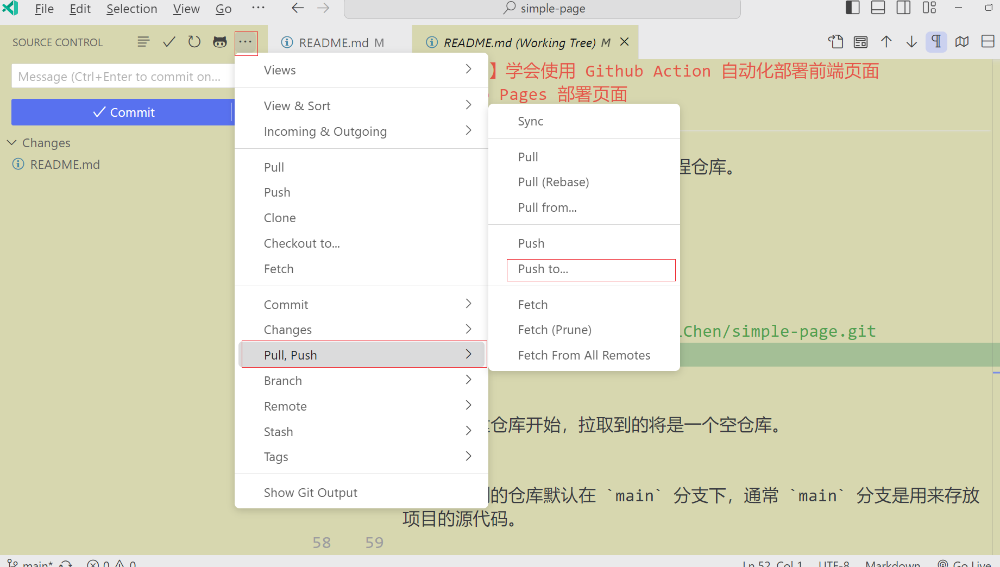
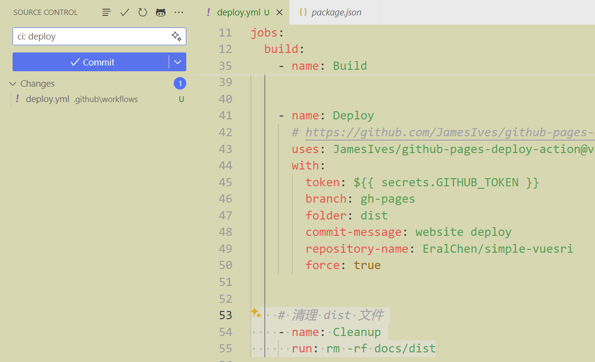

# 【CI/CD】保姆级教学 Github Action 自动化部署前端页面(Github Pages)


## 序

你可能见过类似于这样的网站，

https://eralchen.github.io/vuesri

https://zhgcao.github.io

它可能是某人的博客、某个共享库的文档，

他们被叫做 `Github Pages`，是 Github 提供的一个静态页面托管服务。

如果你也想将自己的页面展示在互联网上，那么 `Github Pages` 是一个不错的选择。

配合 `Github Action`，只需要将代码推送到 `Github` 仓库，就可以自动部署 `Github Pages` .

## Github Pages 部署页面

这里从一个新的仓库开始，介绍如何使用 `Github Pages` 部署页面。

### 新建仓库

[Create a new repository](https://github.com/new), 填写仓库名称，点击 `Create repository`


> GitHub Pages 主要设计用于托管公开仓库的静态网站和文档。
>
> public 仓库免费使用，private 仓库需要付费升级 GitHub 账号。


### 初始化仓库


你可以根据提示来初始化仓库，

可以初始化一个新的仓库，

也可以 `push` 已存在的仓库到远程仓库。


这里已初始化一个新的仓库，为例:

```bash
# git clone [仓库地址] 
git clone git@github.com:EralChen/simple-page.git
```

如果从新建仓库开始，拉取到的将是一个空仓库。


我们拉取到的仓库默认在 `main` 分支下，通常 `main` 分支是用来存放项目的源代码。

这里我们先简单放上一个 `README.md` 文件，然后提交到远程仓库。





### 建立空的 `gh-pages` 分支

习惯上，通常将 `Github Pages` 的页面放在 `gh-pages` 分支下。

因此我们需要在仓库中新建一个空的 `gh-pages` 分支。

```bash
# 这将创建一个新的空分支，该分支不会包含任何历史记录。
git checkout --orphan gh-pages

# 清空当前所有文件
git rm -rf .
```

添加一个最简单的 `index.html` 文件，到 `gh-pages` 分支。


### 部署 Github Pages

`gh-pages` 分支下的文件就是我们要部署的页面。

而在默认情况下，`Github Pages` 会自动部署 `gh-pages` 分支下的文件。


在仓库的 `Settings` 中，找到 `GitHub Pages` 配置项，可以操控一些更细节的配置


如你所见，这就是在 `Github Pages` 部署页面的全部！

$\color{red}{
  简而言之，就是把页面放在 `gh-pages` 分支下，仅此而已！
}$


## Github Action 自动化部署

### 手动部署流程

我们已经学会了怎么使用 `Github Pages` 部署页面。

在学习 `Github Action` 自动化部署之前

假设我们已经有了一个 **现代化工程** 的博客仓库，我们可以想象一下，我们如何**手动部署页面**: 


1. git clone 仓库

2. npm install 更新依赖

3. npm run build 打包项目，生成 包含 index.html 的 dist

4. 建立或者切换到 `gh-pages` 分支

5. 将 dist 文件夹下的所有文件替换到 `gh-pages` 分支下

6. 提交并推送 `gh-pages` 分支到远程仓库

7. 等待 `Github Pages` 自动部署，即可访问页面


### 自动化部署流程

`Github Action` 可以帮助我们完成这一枯燥的过程。

此前如果你对 **自动化部署** 有些迷惑，稍后可以参考我的另一篇文章

[【CI/CD】写给前端的自动化部署攻略](https://juejin.cn/post/7336859907349594112)

它将帮助你更好地理解自动化部署的本质。


观察上述手动部署流程的过程，`Github Action` 需要完成的核心工作就是

+ 打包产出 `dist`

  > 我们的源代码托管在 `Github`,  如果`Github` 可以执行打包命令，就可以生成 `dist` 文件夹

+ 将 `dist` 文件完全替换到 `gh-pages` 分支

  > 毫无疑问，如果由 `Github` 生成 dist 文件夹，对于 `Github` 来说，这是一个很简单的操作


### Github Action 配置

实际上，使用 GitHub Actions，就是在代码仓库中设置自定义的流水线，以响应各种事件，如代码推送、拉取请求（PR）的创建和关闭等。

自动化部署只是 `Github Action` 的一个应用场景。

我们可以在仓库的 `.github/workflows` 目录下，创建一个 `yml` 文件，来配置 `Github Action` 的流程。

`Github` 会自动识别这个目录下的文件, 根据文件内容执行相应的操作。

先来简单认识一下，查看一份部署的完整配置： 

```yml
name: Build and Deploy

on:
  push:
    branches:
      - main

jobs:
  build:
    runs-on: ubuntu-latest

    steps:

    - uses: actions/checkout@v2

    - name: Install dependencies
      run: | 
        npm install -g pnpm
        pnpm install

    - name: Build
      run: npm run build
      env:
        DOC_ENV: production
        NODE_OPTIONS: --max-old-space-size=4096

    - name: Deploy
      uses: JamesIves/github-pages-deploy-action@v4.3.4
      with:
        token: ${{ secrets.GITHUB_TOKEN }}
        branch: gh-pages
        folder: dist
        force: true
        commit-message: website deploy
        repository-name: EralChen/simple-vuesri

    - name: Cleanup
      run: rm -rf docs/dist

```

接下来我们使用一个例子来做实际的演示, 再做详细的解释


## 完整的案例


[simple-vuesri](https://github.com/EralChen/simple-vuesri) 是一个 `vite` + `vue3` 构建的简单页面。

作为这个仓库的拥有者，我希望，将最终打包的页面使用 `Github Pages` 部署，使之能够在互联网上访问。并且，每次向 `main` 分支提交的的时候，更新最终部署的页面。


### 编写 Action

1. 拉取代码
2. 添加 `deploy.yml`,  参考上述完整的配置


```yml
# 在 main 分支上 push 时触发 action
on:
  push:
    branches:
      - main
```
```yml
# https://github.com/actions/checkout
# 签出您的存储库，以便您的工作流可以访问它
- uses: actions/checkout@v4
```

```yml
# 使用 pnpm 安装依赖
- name: Install dependencies
  run: | 
    npm install -g pnpm
    pnpm install
```

```yml
# 可以按照需要，执行一些打包前的操作，如复制文件
- name: Prebuild
  run: |
    npm run copy
    
# 这个项目中 
# "copy": "ncp ./node_modules/@arcgis/core/assets ./public/Esri"
# 是一段拷贝静态文件到 pulic 的脚本
```
```yml
# 打包
- name: Build
  run: npm run build
  env:
    NODE_OPTIONS: --max-old-space-size=4096
```


```yml
- name: Deploy
  # https://github.com/JamesIves/github-pages-deploy-action
  uses: JamesIves/github-pages-deploy-action@v4.3.4
  with:
    token: ${{ secrets.GITHUB_TOKEN }}
    # 推送到哪个分支上
    branch: gh-pages
    # 推送哪个文件里的内容
    folder: dist
    # 是否强制提交
    force: true
    # 提交时候的 commit 消息
    commit-message: website deploy
    # 提交到哪个仓库的，默认是本仓库，所以这里也可以忽略不写
    repository-name: EralChen/simple-vuesri

```

```yml
# 提交完成后，清理 dist 文件
- name: Cleanup
  run: rm -rf dist
```

3. 提交并推送到远程仓库



4. 可以通过查看 `Actions` 面板，来查看运行状态


如图，我们编写的 `Action` 已经成功在 `Github` 上运行。

只不过运行的过程中，产生了一个权限相关的错误，我们来解决它。

### 解决权限问题


根据上述错误信息，我们需要在 `Deploy` 运行时，提供一个有权限的 `token`


#### 申请 Token

可以在 [Developer Settings](https://github.com/settings/apps) 申请一个 `Personal access tokens`， 勾上对仓库读写权限


#### 配置 Secrets

拷贝创建的 `TOKEN` 配置到 `Actions Secrets` 中


#### 修改 yml


#### 重新提交


`Action` 运行完毕！

#### 查看页面

可以查看对应 [分支 ](https://github.com/EralChen/simple-vuesri/tree/gh-pages)与 [网页](https://eralchen.github.io/simple-vuesri/) 


这里页面显示空白，是因为在未配置域名的情况下，`github` 采用 `*.github.io/{repository}` 以仓库地址作为子路径。需要前端工程打包时，对`base`进行配置。


### 前端配置 Base


## 结

`GitHub` 是一个很优秀的平台。对于开发者而言，利用 `GitHub Pages` 和 `GitHub Actions` ，我们能够很轻松地将自己的项目部署到互联网上。


